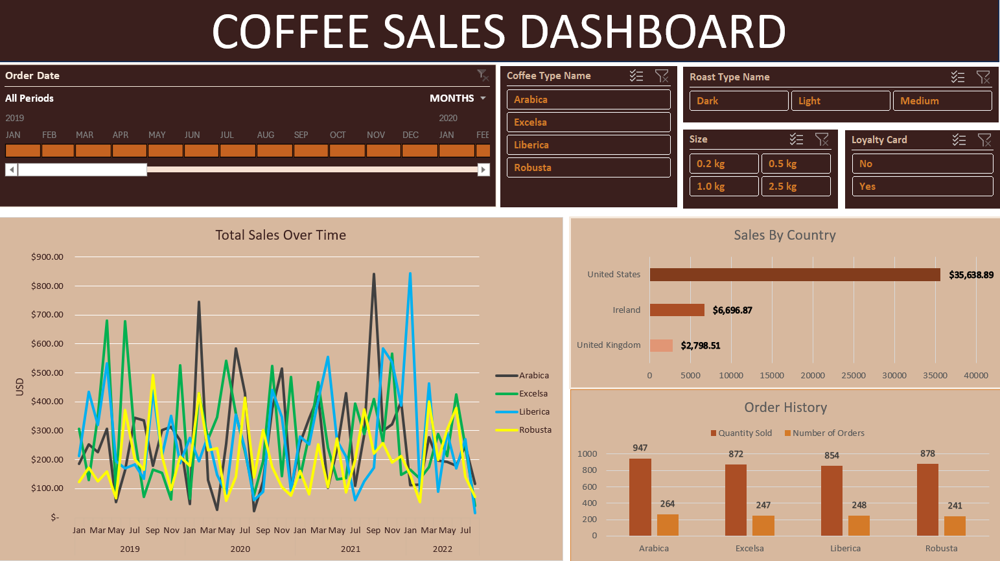

# _Coffee Sales Dashboard_ 

## Project Overview
This aim of the following project was to create a sales Dashboard for Coffee Sales from provided datasets, using only Excel for all needed processes. Ultimately, the interactive and dynamic dashboard enables the company to further understand the customer-to-product relationship, alongside the growth of the company over time. 

## Data Source
Datasets were sourced from a single Excel Workbook created by [Mo Chen](https://github.com/mochen862/excel-project-coffee-sales/blob/main/coffeeOrdersData.xlsx), a professional Data Analyst; however, the file has been included in this repository [Here](https://github.com/ShavonneReynolds/Coffee-Orders-Dashboard/blob/main/coffeeOrdersData%20(1).xlsx).

## Tools 
- Excel
  - This project was an Excel-only project; therefore all processes were done using only Microsoft Excel.

## Process 

### Data Cleaning and Preparation  
- Applied **XLOOKUP** to retrieve relevant data efficiently between worksheets.  
- Utilized **INDEX() MATCH()** for advanced and dynamic lookups between worksheets.  
- Created new & necessary calculated fields.  
- Implemented **multiple IF functions**, as well as **nested IF functions** to properly categorize data.  
- Standardized entries with **date formatting** and **number formatting**.  
- Checked for and removed **duplicate entries** to ensure data integrity.  
- Converted raw data ranges into structured **Excel tables** for easier and more dynamic manipulation.  

### Data Visualization  
- Designed **Pivot Tables and Pivot Charts** to summarize and visualize data trends.  
- Increased user interaction with **timelines**.  
- Added **slicers** for quick dynamic filtering and exploration of data.  

### Dashboard Creation  
- Updated **Pivot Table data sources** to connect all designs in order to reflect new or modified data.  
- Integrated all elements into a cohesive **dashboard** for interactive reporting.   

## Questions
- Which year had the highest total sales?
- Who purchased more - Loyalty members or non-loyalty members?
- What country had the highest sales each year?
- What is the most popular coffee type overall? Each year?
- What was the highest selling roast overall? Each year?
- Is there a preference in size for customers?

# Project Insight
- Total Sales were the best in 2021, with the US and Ireland having their highest-performing years.
- Non-loyalty card holders brought in more money overall than loyalty card members
- Light is the most popular roast type as they have the highest sales and quantities ordered by customers
- Excelsa was the highest in sales; however, Arabica is the most popular amongst customers as it has the largest number of orders and quantities sold.
- The size of 2.5 kg is the highest in sales, but 0.5 is most popular amongst customers displayed by their large amount of orders and quantities sold.

## Final Conclusion

